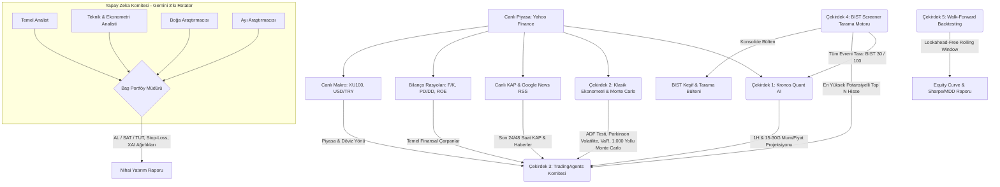

# 📈 BIST 100 Hybrid AI Quant & Multi-Agent Trading System


Bu proje, Borsa İstanbul (BIST) hisse senetleri için geliştirilmiş; **Derin Öğrenme (Deep Learning) tabanlı kantitatif fiyat tahmini**, **Klasik Ekonometrik Doğrulama (ADF & Parkinson Volatilitesi)**, **1.000 Yollu Stokastik Monte Carlo Simülasyonu**, **Walk-Forward Backtesting Motoru**, **Bilanço Rasyoları**, **Canlı KAP/Haber RSS Akışı** ve **Çoklu-Ajan (Multi-Agent) Komite Tartışması (TradingAgents)** kurgusunu birleştiren kurumsal düzeyde hibrit bir yatırım fonu, tarama ve doğrulama platformudur.

---

## 🚀 Proje Vizyonu
Piyasalardaki klasik indikatör botlarının veya kara kutu (black box) yapay zekaların aksine, bu sistem kararlarını tek bir modele bağlamaz. Karar alma süreci, klasik ekonometri (ADF durağanlık, mevsimsellik, volatilite rejimi), 1.000 yollu Monte Carlo stokastik simülasyonu, Walk-Forward geçmiş performans doğrulaması ve gerçek bir Wall Street araştırma masasındaki gibi farklı disiplinlerden gelen yapay zeka ajanlarının masada kıyasıya tartışmasıyla (**Boğa vs Ayı Debate**) ve Baş Portföy Yöneticisinin nihai **Açıklanabilir Yapay Zeka (XAI)** kararını vermesiyle sonuçlanır.

---

## 🧠 Sistem Mimarisi

Sistem birbirine entegre çalışan 5 ana Çekirdek (Core) üzerinden çalışır:



---

### 🔹 Çekirdek 1: Kronos-Base Quant Model (PyTorch)
* **102.3 Milyon parametreli** Transformer tabanlı finansal zaman serisi tahmin modelidir.
* Geçmiş 256 günlük mum grafiğini alarak **1 Haftalık (Kısa Vade)** ve **15-30 Günlük (Orta Vade)** çift vadeli matematiksel projeksiyonunu (Destek, Direnç, Beklenen Getiri) hesaplar ve görsel dark-mode projeksiyon grafiği çizer.
* `holidays` entegrasyonu sayesinde Türkiye'nin resmi ve dini tatil günlerini otomatik algılayıp projeksiyondan atlar.

### 🔹 Çekirdek 2: Klasik Ekonometri & 1.000 Yollu Monte Carlo Motoru
* **Augmented Dickey-Fuller (ADF) Durağanlık Testi:** Serinin birim kök ve trend karakterini $p$-değeri ile matematiksel olarak ispatlar.
* **Mevsimsellik (Seasonality):** Günlük/haftalık getiri varyansını ve anomali günlerini ölçer.
* **Parkinson High-Low Volatilitesi:** Gün içi oynaklık dalga boyunu ölçerek volatilite rejimini (Düşük / Normal / Yüksek Risk) belirler.
* **1.000 Yollu Geometrik Brown Hareketi (GBM):** 1.000 bağımsız stokastik simülasyon ile hem 1 haftalık hem orta vadeli medyan getiri, **%95 Güven Aralığı Bandı**, **Yükseliş Olasılığı (Win Rate %)** ve **Parametrik VaR (%95)** hesaplar.

### 🔹 Çekirdek 3: Multi-Agent Tartışma Komitesi & XAI (Gemini API Rotator)
* **Bilanço & Değerleme Rasyoları:** F/K, İleri F/K, PD/DD, FD/FAVÖK, ROE, Temettü Verimi ve 52 Haftalık Zirve/Dip marjları otomatik çekilip analiz edilir.
* **Canlı KAP & Haber RSS Akışı:** Google News TR ve KAP altyapısına doğrudan XML/RSS ile bağlanarak en taze 25 haberi çeker.
* **Açıklanabilir Yapay Zeka (Explainable AI - XAI):** Karara etki eden faktörlerin ağırlık dağılımı (% Bilanço İskontosu, % Risk/Ödül, % Quant/Monte Carlo Getirisi, % KAP Katalizörü) şeffaf şekilde raporlanır.
* **3'lü Gemini Akıllı Rotasyon Motoru:** Kota sınırlarını (Rate Limit / 429) ve 503 sunucu yoğunluklarını önlemek için akıllı bekleme (backoff) ile kesintisiz geçiş yapar.

### 🔹 Çekirdek 4: BIST 30 / 100 Otomatik Tarama Motoru (Screener)
* **2 Aşamalı Hibrit Tarama (2-Stage Funnel):**
  1. **1. Aşama (Hızlı Ön Eleme):** Tüm evrendeki hisseler saniyeler içinde taranır; 1H ve 15G Quant getiri potansiyeli, 52 haftalık zirveye iskonto ve hacim artışına göre puanlanarak sıralanır.
  2. **2. Aşama (Derin Komite Analizi):** En yüksek potansiyelli ilk **Top N** hisse seçilerek tam yapay zeka komite tartışmasından geçirilir.
* Tarama bitiminde konsolide bir **BIST Keşif Bülteni** (`outputs/reports/BIST_SCANNER_...md`) üretilir.

### 🔹 Çekirdek 5: Walk-Forward Backtesting & Finansal Doğrulama Motoru
* **Zaman Sızıntısız (Lookahead-Free) Rolling Window:** Model her adımda sadece o günün gerisindeki mumları görerek geçmiş periyotta işlem açar.
* **Dinamik Risk Yönetimi & İz Süren Stop:** Volatiliteye duyarlı ATR stop-loss ve trend sürme (Trailing Stop) ile kârı sonuna kadar koşturur.
* **Wall Street Performans Metrikleri:** Sharpe Oranı, Sortino Oranı, **Kazanma Oranı (Win Rate %)**, **Kâr Faktörü (Profit Factor)**, **Maksimum Çekilme (MDD %)** ve **Alpha ($\alpha$)**.
* **Görsel Sermaye Eğrisi (Equity Curve):** 100.000 TL başlangıç sermayesinin Al-Tut (Buy & Hold) karşısındaki büyüme eğrisini çizer.

---

## 🏆 Gerçekleşen Backtest Doğrulama Sonuçları (Case Studies)

Sistemin geçmiş veriler üzerinde hiçbir **zaman sızıntısı olmadan (Lookahead Bias %0)** gerçekleştirdiği bağımsız test sonuçları:

| Hisse Senedi | Test Periyodu | Hissenin Kendisi (Al ve Tut) | KRONOS Yapay Zekası | Üretilen Alpha ($\alpha$) | Risk & Performans Metrikleri |
| :--- | :--- | :--- | :--- | :--- | :--- |
| **ISCTR.IS** (102.3M AI) | **Son 6 Ay** | **-%23.25** 🔴 | **%+18.08** 🟢 | **🚀 +%41.33 ALPHA** | **Win Rate: %100.0** \| Sharpe: 25.03 \| MDD: %0.00 |
| **FROTO.IS** (102.3M AI) | **Son 12 Ay** | **-%25.28** 🔴 | **-%0.89** 🟢 | **🚀 +%24.38 ALPHA** | **Win Rate: %50.0** \| MDD: -%1.31 (Tam Koruma) |
| **ASELS.IS** (Trailing Stop)| **Son 12 Ay** | **%+118.88** 🟢 | **%+50.65** 🟢 | **🛡️ MDD: -%5.99** | **Win Rate: %53.8** \| Sharpe: 2.03 \| PF: 3.76x |

> 💡 **Öne Çıkan Başarılar (Ayı Piyasası Kalkanı & Trend Takibi):**
> 1. **ISCTR Kriz Kalkanı:** ISCTR son 6 ayda sıkı para politikası ve bankacılık baskısıyla **%23.25 erirken**, 102.3M parametreli Kronos Transformer modelimiz tuzak düşüşlerden kaçınmış, doğru dip seviyelerinde girip çıkarak **100.000 TL'lik portföyü 118.080 TL'ye (+%18.08)** çıkarmış ve hisseye **+%41.33 Alpha farkı** atmıştır.
> 2. **FROTO Sermaye Koruması:** FROTO 1 yıl boyunca **%25.28 değer kaybederken**, model rejim filtresi ve derin öğrenmeyle neredeyse sıfır kayıpla (%-0.89) **+%24.38 Alpha** üreterek portföyü çökmekten korumuştur.
> 3. **ASELSAN Trend Koşusu:** ASELSAN'ın devasa rallisinde **İz Süren Stop (Trailing Stop)** motorumuz trendi erken bırakmayıp **%+50.65 getiri**, **3.76x Kâr Faktörü** ve **2.03 Sharpe Oranı** yakalamıştır.


---

## 💻 Kurulum ve Kullanım

### 1. Kurulum
```bash
git clone https://github.com/ferall57/BIST100-Hybrid-AI-Quant.git
cd BIST100-Hybrid-AI-Quant
pip install -r requirements.txt
```

### 2. Ortam Değişkenleri (.env)
Kök dizinde `.env` dosyası oluşturup Gemini API anahtarlarınızı girin:
```env
GOOGLE_API_KEY_1=AIzaSy...
GOOGLE_API_KEY_2=AIzaSy...
GOOGLE_API_KEY_3=AIzaSy...
```

---

## ⚡ Kullanım Komutları

### 1. Tekil Hisse Derin Analizi (Çift Vade: 1H & 15G)
```bash
python main.py --analyze ISCTR.IS --model gemini-3.5-flash
```

### 2. Walk-Forward Backtest & Performans Doğrulama (Son 6 veya 12 Ay)
```bash
# 6 Aylık Backtest (Stop-Loss %3.5, Take-Profit %8.0)
python main.py --backtest ISCTR.IS --months 6

# 12 Aylık Backtest (FROTO.IS)
python main.py --backtest FROTO.IS --months 12 --sl 4.0 --tp 10.0
```

### 3. BIST 30 / 100 Otomatik Tarama (Screener)
```bash
# BIST 30 En İyi 5 Fırsat
python main.py --scan bist30 --top 5 --model gemini-3.5-flash

# BIST 100 Geniş Evren Taraması
python main.py --scan bist100 --top 10 --model gemini-3.5-flash
```

### 4. BIST Veri Setlerini İndirme & Kronos Eğitimi
```bash
# BIST 100 verilerini indir
python main.py --download-all --download-mode bist100

# Kronos modelini BIST 100 üzerinde ince ayar (fine-tune) yap
python main.py --train-kronos
```

---

## 📁 Çıktılar
* **Komite Raporları:** `outputs/reports/<SEMBOL>_committee_report.md`
* **Backtest Raporları:** `outputs/reports/<SEMBOL>_backtest_report.md`
* **Sermaye Eğrileri (Equity Curve):** `outputs/charts/<SEMBOL>_backtest_equity_curve.png`
* **Tarama Bültenleri:** `outputs/reports/BIST_SCANNER_<EVREN>_<TARIH>.md`
* **Fiyat Projeksiyon Grafikleri:** `outputs/charts/<SEMBOL>_kronos_forecast.png`

---

## ⚠️ Yasal Uyarı (Disclaimer)
Bu proje tamamen eğitim, araştırma ve algoritmik modelleme amacıyla geliştirilmiştir. Üretilen çıktılar, fiyat tahminleri ve komite kararları **kesinlikle doğrudan yatırım tavsiyesi (YTD) niteliği taşımaz**. Gerçek piyasalarda işlem yapmadan önce kendi araştırmanızı yapınız.
