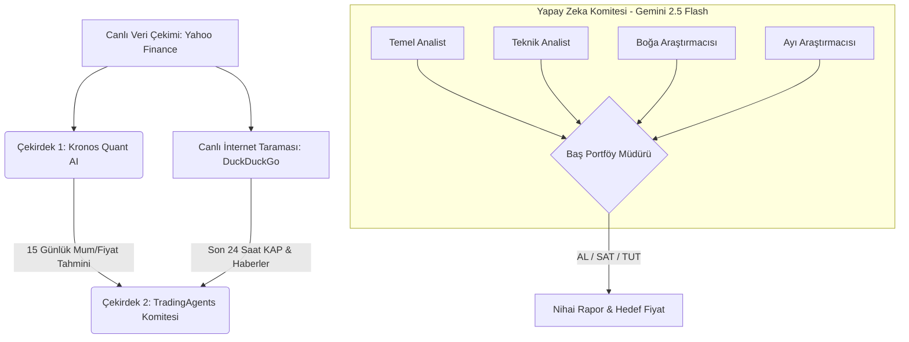

# 📈 BIST 100 Hybrid AI Quant & Multi-Agent Trading System


Bu proje, Borsa İstanbul (BIST 100) hisse senetleri için geliştirilmiş, **Derin Öğrenme (Deep Learning) tabanlı kantitatif fiyat tahmini** ile **Büyük Dil Modeli (LLM) tabanlı Çoklu-Ajan (Multi-Agent) komite tartışmasını** birleştiren devasa bir hibrit yatırım fonu simülatörüdür.

## 🚀 Proje Vizyonu
Piyasalardaki klasik analiz botlarının aksine, bu sistem kararlarını tek bir algoritmaya bağlamaz. Karar alma süreci tıpkı gerçek bir Wall Street yatırım ofisindeki gibi farklı disiplinlerden gelen yapay zeka ajanlarının masada kıyasıya tartışmasıyla (Boğa vs Ayı) ve bir Portföy Yöneticisinin nihai kararı vermesiyle sonuçlanır.

## 🧠 Sistem Mimarisi

Sistem birbirine entegre çalışan iki ana "Çekirdek" (Core) üzerinden çalışır:



### 🔹 Çekirdek 1: Kronos-Base Quant Model (PyTorch)
* 102.3 Milyon parametreli Transformer tabanlı bir zaman serisi tahmin modelidir.
* Kısıtlı donanımlarda (4GB VRAM) eğitilebilmesi için **AMP (Automatic Mixed Precision)** ve **GradScaler** kullanılarak donanımsal olarak optimize edilmiştir.
* Geçmiş 256 günlük mum grafiğini (Açılış, Kapanış, Yüksek, Düşük, Hacim) alarak önümüzdeki 15 günün matematiksel projeksiyonunu (Destek, Direnç, Beklenen Getiri) çizer.

### 🔹 Çekirdek 2: Multi-Agent Tartışma Komitesi (Gemini 2.5 Flash)
* **Canlı İnternet Bağlantısı (Web Scraping):** Analizden saniyeler önce DuckDuckGo üzerinden hissenin son 24-48 saatlik güncel haberlerini ve KAP bildirimlerini çeker.
* **Akıllı API Rotasyonu (Rotator):** Sistemde oluşabilecek Rate Limit / Kota aşımı (ResourceExhausted) hatalarını önlemek için çoklu API anahtarı arasında saniyesinde otomatik geçiş (failover) yapar.
* **Tartışma Dinamiği:** Temel ve Teknik analistlerin verilerini alan Boğa (İyimser) ve Ayı (Kötümser) yapay zekalar birbirlerinin tezlerini çürütmeye çalışır. Baş Portföy Yöneticisi bu tartışmayı okuyarak nihai kararı (Güven Katsayısı, Hedef Fiyat ve Stop-Loss) açıklar.

## 💻 Kurulum ve Kullanım

### Gereksinimler
* Python 3.10+
* PyTorch (CUDA önerilir)
* yfinance, duckduckgo-search, langchain-google-genai

### Çalıştırma (Örnek)
Sistemi herhangi bir BIST100 hissesi (örn: İş Bankası) için ateşlemek için:
```bash
python main.py --analyze ISCTR.IS --model gemini-2.5-flash
```

## ⚠️ Yasal Uyarı (Disclaimer)
Bu proje tamamen eğitim ve teknolojik araştırma (Yapay zekanın finansal karar alma süreçlerindeki rolü) amacıyla geliştirilmiştir. Üretilen çıktılar, fiyat tahminleri ve komite kararları **kesinlikle yatırım tavsiyesi (YTD) değildir**. Gerçek para ile işlem yapmadan önce kendi araştırmanızı yapınız.
