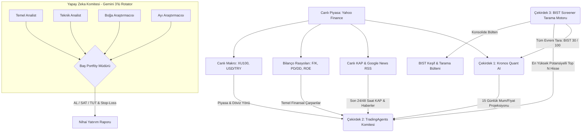

# 📈 BIST 100 Hybrid AI Quant & Multi-Agent Trading System


Bu proje, Borsa İstanbul (BIST) hisse senetleri için geliştirilmiş; **Derin Öğrenme (Deep Learning) tabanlı kantitatif fiyat tahmini**, **Bilanço Rasyoları & Makro Entegrasyonu**, **Canlı KAP/Haber RSS Beslemeleri** ve **Çoklu-Ajan (Multi-Agent) Komite Tartışması (TradingAgents)** kurgusunu birleştiren kurumsal düzeyde hibrit bir yatırım fonu ve tarama platformudur.

---

## 🚀 Proje Vizyonu
Piyasalardaki klasik indikatör botlarının aksine, bu sistem kararlarını tek bir algoritmaya bağlamaz. Karar alma süreci, gerçek bir Wall Street veya Maslak araştırma masasındaki gibi farklı disiplinlerden gelen yapay zeka ajanlarının masada kıyasıya tartışmasıyla (**Boğa vs Ayı Debate**) ve Baş Portföy Yöneticisinin nihai kararı (Hedef Fiyat, Güven Oranı, Stop-Loss) vermesiyle sonuçlanır.

---

## 🧠 Sistem Mimarisi

Sistem birbirine entegre çalışan 3 ana Çekirdek (Core) üzerinden çalışır:



---

### 🔹 Çekirdek 1: Kronos-Base Quant Model (PyTorch)
* **102.3 Milyon parametreli** Transformer tabanlı finansal zaman serisi tahmin modelidir.
* Geçmiş 256 günlük mum grafiğini (Açılış, Kapanış, Yüksek, Düşük, Hacim) alarak önümüzdeki 15-30 günün matematiksel projeksiyonunu (Destek, Direnç, Beklenen Getiri) hesaplar ve görsel dark-mode projeksiyon grafiği çizer.
* `holidays` entegrasyonu sayesinde Türkiye'nin resmi ve dini tatil günlerini otomatik algılayıp projeksiyondan atlar.

### 🔹 Çekirdek 2: Multi-Agent Tartışma Komitesi (Gemini API Rotator)
* **Bilanço & Değerleme Rasyoları:** Her hisse için F/K, İleri F/K (Forward P/E), PD/DD, FD/FAVÖK, Özsermaye Kârlılığı (ROE), Temettü Verimi ve 52 Haftalık Zirve/Dip marjları otomatik çekilip analiz edilir.
* **Canlı KAP & Haber RSS Akışı:** Google News TR ve KAP altyapısına doğrudan XML/RSS ile bağlanarak en taze 25 haberi çeker.
* **Makro Veri Bağlantısı:** BIST 100 Endeksi (XU100) trendi ve USD/TRY kuru her analize canlı aktarılır.
* **3'lü Gemini Akıllı Rotasyon Motoru:** Kota sınırlarını (Rate Limit / ResourceExhausted / 429) önlemek için yedek API anahtarları arasında kesintisiz geçiş (Failover & Rotation) yapar.
* **Debate Kurgusu:** Temel ve Teknik raporları alan Boğa (İyimser) ve Ayı (Kötümser) analistler birbirlerinin tezlerini çürütür; Baş Portföy Yöneticisi nihai kararı verir.

### 🔹 Çekirdek 3: BIST 30 / 100 Otomatik Tarama Motoru (Screener)
* **2 Aşamalı Hibrit Tarama (2-Stage Funnel):**
  1. **1. Aşama (Hızlı Ön Eleme):** Tüm evrendeki hisseler saniyeler içinde taranır; Quant getiri potansiyeli, 52 haftalık zirveye iskonto ve hacim artışına göre puanlanarak sıralanır.
  2. **2. Aşama (Derin Komite Analizi):** En yüksek potansiyelli ilk **Top N** hisse seçilerek tam yapay zeka komite tartışmasından geçirilir.
* Tarama bitiminde konsolide bir **BIST Keşif Bülteni** (`outputs/reports/BIST_SCANNER_...md`) üretilir.

---

## 💻 Kurulum ve Kullanım

### 1. Kurulum
```bash
git clone https://github.com/ferall57/BIST100-Hybrid-AI-Quant.git
cd BIST100-Hybrid-AI-Quant
pip install -r requirements.txt
```

### 2. Ortam Değişkenleri (.env)
Kök dizinde `.env` dosyası oluşturup Gemini API anahtarlarınızı girin:
```env
GOOGLE_API_KEY_1=AIzaSy...
GOOGLE_API_KEY_2=AIzaSy...
GOOGLE_API_KEY_3=AIzaSy...
```

---

## ⚡ Kullanım Komutları

### 1. Tekil Hisse Derin Analizi
```bash
python main.py --analyze ISCTR.IS --model gemini-3.5-flash
```

### 2. BIST 30 Otomatik Tarama (En İyi 5 Hisse)
```bash
python main.py --scan bist30 --top 5 --model gemini-3.5-flash
```

### 3. BIST 100 Geniş Evren Taraması (En İyi 10 Hisse)
```bash
python main.py --scan bist100 --top 10 --model gemini-3.5-flash
```

### 4. BIST Veri Setlerini İndirme & Kronos Eğitimi
```bash
# BIST 100 verilerini indir
python main.py --download-all --download-mode bist100

# Kronos modelini BIST 100 üzerinde ince ayar (fine-tune) yap
python main.py --train-kronos
```

---

## 📁 Çıktılar
* **Komite Raporları:** `outputs/reports/<SEMBOL>_committee_report.md`
* **Tarama Bültenleri:** `outputs/reports/BIST_SCANNER_<EVREN>_<TARIH>.md`
* **Fiyat Projeksiyon Grafikleri:** `outputs/charts/<SEMBOL>_kronos_forecast.png`

---

## ⚠️ Yasal Uyarı (Disclaimer)
Bu proje tamamen eğitim, araştırma ve algoritmik modelleme amacıyla geliştirilmiştir. Üretilen çıktılar, fiyat tahminleri ve komite kararları **kesinlikle doğrudan yatırım tavsiyesi (YTD) niteliği taşımaz**. Gerçek piyasalarda işlem yapmadan önce kendi araştırmanızı yapınız.
