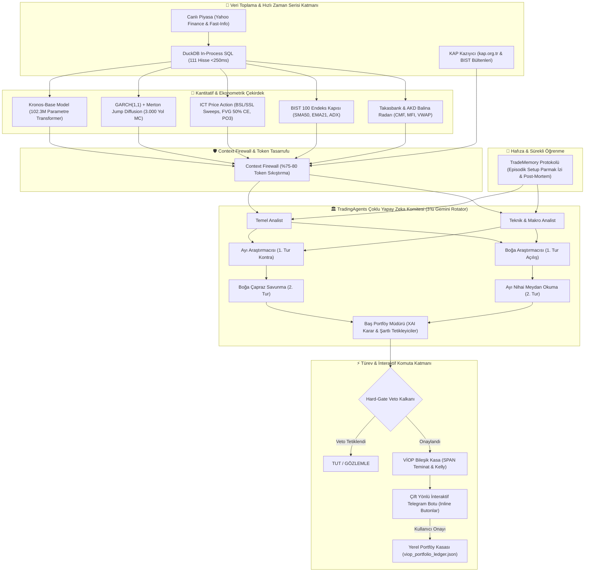

# 🏛️ KRONOS: BIST 100 & VİOP Hybrid AI Quant, Econometrics & Institutional Trading System

<div align="center">


</div>

**KRONOS**, Borsa İstanbul (BIST 100 / BIST 30) hisse senetleri ve VİOP kaldıraçlı vadeli işlem piyasaları için geliştirilmiş; **Derin Öğrenme (Deep Learning) tabanlı foundation model fiyat tahmini**, **İleri Ekonometri & 5 Tanı Testi**, **GARCH(1,1) & Merton Poisson Jump Diffusion Stokastik Simülasyonu**, **ICT Smart Money (SMC) Likidite & FVG Motoru**, **BIST 100 Makro Endeks Kapısı (Gatekeeper)**, **DuckDB Mikro-Saniye SQL Zaman Serisi**, **Canlı KAP & BIST Bülten Kazıyıcı**, **TradeMemory Episodik İşlem Hafızası**, **Çift Yönlü İnteraktif Telegram Komuta Merkezi** ve **2 Turlu Çoklu-Ajan (Multi-Agent) Boğa vs. Ayı Diyalektik Münazarası (TradingAgents)** mimarisini tek bir çatı altında birleştiren yeni nesil kurumsal kantitatif yatırım yönetim platformudur.

---

## 🚀 Proje Vizyonu ve Felsefesi

Klasik teknik indikatör botlarının (RSI, MACD vb.) piyasadaki kurumsal tuzaklara düşmesi veya basit kara kutu (black-box) yapay zekaların piyasa rejimini anlayamaması sorununa karşı KRONOS, **çok katmanlı bir savunma ve filtreleme kalkanı** ile çalışır:

1. **Önce Makro ve Likidite:** Endeks (XU100) trend altında ise tekil hissede long açılmaz (**Endeks Kapısı Veto Kalkanı**).
2. **Akıllı Para Ayak İzi:** Eski tepeler/dipler süpürülmeden ve Fair Value Gap (FVG) oluşmadan işleme girilmez (**ICT Smart Money Engine**).
3. **Kurumsal Balina Teyidi:** Bank of America, İş Yatırım ve Takasbank para akışı (CMF, MFI, VWAP) alım yönünde değilse işlem veto edilir (**AKD Balina Radarı**).
4. **Matematiksel Risk Sınaması:** 1.000 yollu Merton Monte Carlo simülasyonunda kazanma olasılığı <%38 ise modelin pozitif yanlılığı doğrudan engellenir (**Deterministik Hard-Gate Veto**).
5. **Diyalektik Münazara:** Boğa ve Ayı analistleri 2 tur boyunca verileri çarpıştırır; Baş Portföy Müdürü (Executive Manager) hakemliğinde **Açıklanabilir Yapay Zeka (XAI)** kararı üretilir.

---

## 🧠 Bütünleşik Sistem Mimarisi


```mermaid
flowchart TD
    subgraph Data_Layer ["📡 Veri Toplama & Hızlı Zaman Serisi Katmanı"]
        YF["Canlı Piyasa (Yahoo Finance & Fast-Info)"]
        KAP["KAP Kazıyıcı (kap.org.tr & BIST Bültenleri)"]
        DDB["DuckDB In-Process SQL (111 Hisse <250ms)"]
        YF --> DDB
    end

    subgraph Quant_Layer ["📐 Kantitatif & Ekonometrik Çekirdek"]
        KRONOS_AI["Kronos-Base Model (102.3M Parametre Transformer)"]
        ECON["GARCH(1,1) + Merton Jump Diffusion (3.000 Yol MC)"]
        ICT["ICT Price Action (BSL/SSL Sweeps, FVG 50% CE, PO3)"]
        GATE["BIST 100 Endeks Kapısı (SMA50, EMA21, ADX)"]
        AKD["Takasbank & AKD Balina Radarı (CMF, MFI, VWAP)"]
        DDB --> KRONOS_AI
        DDB --> ECON
        DDB --> ICT
        DDB --> GATE
        DDB --> AKD
    end

    subgraph Optimization ["🛡️ Context Firewall & Token Tasarrufu"]
        CFW["Context Firewall (%75-80 Token Sıkıştırma)"]
        KRONOS_AI --> CFW
        ECON --> CFW
        ICT --> CFW
        GATE --> CFW
        AKD --> CFW
        KAP --> CFW
    end

    subgraph Memory_Layer ["🧠 Hafıza & Sürekli Öğrenme"]
        TM["TradeMemory Protokolü (Episodik Setup Parmak İzi & Post-Mortem)"]
    end

    subgraph Committee_Layer ["🏛️ TradingAgents Çoklu Yapay Zeka Komitesi (3'lü Gemini Rotator)"]
        FA["Temel Analist"]
        TA["Teknik & Makro Analist"]
        BULL["Boğa Araştırmacısı (1. Tur Açılış)"]
        BEAR["Ayı Araştırmacısı (1. Tur Kontra)"]
        REB_BULL["Boğa Çapraz Savunma (2. Tur)"]
        REB_BEAR["Ayı Nihai Meydan Okuma (2. Tur)"]
        EXEC["Baş Portföy Müdürü (XAI Karar & Şartlı Tetikleyiciler)"]

        CFW --> FA & TA
        TM --> FA & TA
        FA & TA --> BULL & BEAR
        BULL --> REB_BEAR
        BEAR --> REB_BULL
        REB_BULL & REB_BEAR --> EXEC
    end

    subgraph Execution_Layer ["⚡ Türev & İnteraktif Komuta Katmanı"]
        EXEC --> VETO{"Hard-Gate Veto Kalkanı"}
        VETO -->|Veto Tetiklendi| WAIT["TUT / GÖZLEMLE"]
        VETO -->|Onaylandı| VIOP["VİOP Bileşik Kasa (SPAN Teminat & Kelly)"]
        VIOP --> TG["Çift Yönlü İnteraktif Telegram Botu (Inline Butonlar)"]
        TG -->|Kullanıcı Onayı| LEDGER["Yerel Portföy Kasası (viop_portfolio_ledger.json)"]
    end
```

---

## 🏛️ Temel Mimari Çekirdekler

### 🔹 1. Kronos-Base Foundation Quant Modeli
* **102.3 Milyon parametreli** Transformer tabanlı finansal zaman serisi tahmin motoru.
* Fiziksel mum tutarlılığı kalkanı ($High \ge \max(Open, Close)$ ve $Low \le \min(Open, Close)$) ve BIST ±%10 tavan/taban devre kesici sınırları denetimi.
* 1 Haftalık ve 15-30 Günlük vadelerde çok yollu olasılıksal destek, direnç ve getiri tahmini.

### 🔹 2. İleri Ekonometri, GARCH(1,1) & Merton Jump Diffusion
* **Çift Doğrulamalı Durağanlık:** ADF ve KPSS birim kök / trend sınaması.
* **GARCH(1,1) Dinamik Oynaklık:** Zamana bağlı volatilite kümelenmesini tahmin ederek Monte Carlo adımlarına aktarır.
* **Merton Poisson Jump Diffusion:** BIST'in ani haber şoklarını $dN_t \sim \text{Poisson}(\lambda)$ sıçrama prosesi ile modelleyerek şişman kuyruk (fat-tail) riskini ve CVaR (%95 Parametrik VaR) seviyelerini hesaplar.

### 🔹 3. 5 Temel Ekonometrik Tanı Testi Bataryası
1. **Normallik:** Jarque-Bera ve D'Agostino-Pearson çarpıklık/basıklık testi.
2. **Otokorelasyon:** Durbin-Watson ve Breusch-Godfrey LM yüksek dereceli ardışık bağımlılık testi.
3. **Değişen Varyans:** Breusch-Pagan, White Testi ve ARCH-LM dinamik oynaklık testi.
4. **Model Spesifikasyonu:** Ramsey RESET ($F$-istatistiği) ile doğrusal olmayan form hatası tespiti.
5. **Çoklu Doğrusal Bağlantı:** VIF ve Şartlı Sayı ($CI$) kontrolü.

### 🔹 4. ICT Smart Money (SMC) & Fiyat Hareketi (Price Action) Motoru
* **Likidite Temizliği (BSL / SSL Sweeps):** Eski zirvelerin veya diplerin üzerindeki stop avlarını ve *Turtle Soup* dönüş formasyonlarını yakalar.
* **Fair Value Gap (FVG) & %50 Consequent Encroachment (C.E.):** Sert yer değiştirmelerin (Displacement) bıraktığı dengesizlikleri tespit eder ve optimal limit alım seviyesini belirler.
* **Hacimsiz Kırılım & Onay (Volume Dry-Up Retest):** Hacimsiz geri çekilmeleri panik satışı yerine akıllı para akümülasyonu olarak ayrıştırır.
* **Power of 3 (PO3 / AMD):** Seans açılışındaki manipülasyon (Judas Swing) hareketlerini filtreler.

### 🔹 5. BIST 100 Endeks Trend Kapısı (Index Gatekeeper)
* BIST 100 (XU100) endeksini SMA50, EMA21, RSI14 ve ADX/DMI filtrelerinden geçirir.
* Piyasa rejimini belirler: `BULL_REGIME` (1.0x tahsisat), `NEUTRAL_CHOP` (0.5x tahsisat) ve `BEAR_REGIME` (0.0x - Yeni Long Pozisyonlara Hard Block / Veto).

### 🔹 6. DuckDB Mikro-Saniye Zaman Serisi & SQL Motoru
* In-process analitik SQL veritabanı (`kronos_market.duckdb`).
* 111 hissenin tüm geçmiş günlük mumlarını tek bir optimize tabloda depolar.
* BIST 30 / BIST 100 evren tarama sürelerini 50 saniyeden **<250 milisaniyeye** düşürür.

### 🔹 7. Canlı KAP (Kamuyu Aydınlatma Platformu) & NLP Duygu Kazıyıcı
* `kap.org.tr` açık bildirim akışını canlı olarak takip eder.
* Özel Durum Açıklamaları, Pay Geri Alımları, Yeni İş İlişkileri/İhaleler ve Finansal Raporları ayıklar; NLP skorlaması ile komiteye brifing verir.

### 🔹 8. TradeMemory Protokolü & Episodik İşlem Hafızası
* Geçmiş işlemlerin teknik kurulum parmak izini (`setup_type`, `market_regime`, `pnl`, `lessons_learned`) saklar.
* Yeni hisse analiz edilirken geçmiş benzer işlemleri (Örn: *"BIMAS işleminde 406 TL'ye yaşanan geri çekilme hacimsiz (0.57x) idi; stop'a sadık kalınarak 415.75 TL'ye kârla toparlandı"*) Boğa/Ayı münazarasına doğrudan argüman olarak sunar.

### 🔹 9. Çift Yönlü İnteraktif Telegram Komuta Merkezi
* Yeni sinyalleri dinamik **Inline Keyboard Butonları** (`[✅ Deftere Kaydet]`, `[📊 Durum Sorgula]`, `[❌ Pas Geç]`) ile gönderir.
* Uzun yoklama (Long-Polling) dinleyicisi ile mobilden `/status`, `/scan`, `/close <Hisse>` komutlarını yönetmenizi sağlar.

### 🔹 10. Context Firewall & Token Sıkıştırma Kalkanı
* Devasa mum tablolarını ve metin bloklarını yüksek sinyalli kompakt özet formatına sıkıştırır.
* Gemini modellerine giden prompt girdi boyutunu **%75-80 oranında azaltarak** analiz süresini yarıya indirir ve 503/429 kota aşımı hatalarını engeller.

### 🔹 11. Takasbank & AKD Para Giriş/Çıkış Radarı
* Matriks / İdealData kurum dağılım verilerini okur.
* Chaikin Money Flow (CMF 20G), Money Flow Index (MFI 14G) ve Bank of America / İş Yatırım ilk 5 kurum konsantrasyon dengesini hesaplar.

### 🔹 12. VİOP BSM Greeks, Delta-Hedging & SPAN Bileşik Kasa
* Midas ve Takasbank SPAN teminat oranları ile kuruşu kuruşuna kalibre edilmiştir.
* Kasanın maksimum %35-%40'ını teminata bağlar; serbest kalan %60-%65 nakit Takasbank gecelik faizinde (%45) nemalanır.

---

## 💻 Kullanım Komutları (CLI Rehberi)

### 1. 🔍 Tekil Hisse Tam Komite Analizi
```bash
python main.py --analyze BIMAS.IS --days 15
```

### 2. 🗄️ DuckDB Mum Veritabanını Senkronize Et
```bash
python main.py --sync-db
```

### 3. 🤖 Çift Yönlü İnteraktif Telegram Botunu Başlat
```bash
python main.py --bot
```

### 4. 📊 Otomatik A+ VİOP ve ICT Taraması
```bash
python main.py --scan bist30 --top 5
```

### 5. 🔬 Ekonometrik Tanı & Merton Monte Carlo Raporu
```bash
python main.py --econometrics THYAO.IS --days 15
```

### 6. 💼 Çoklu Model Portföy Optimizasyonu (HRP, Black-Litterman, Kelly)
```bash
python main.py --portfolio-opt "THYAO.IS,ISCTR.IS,AKBNK.IS,ASELS.IS,BIMAS.IS"
```

### 7. 🐋 Takasbank & AKD Kurumsal Balina Para Akışı Taraması
```bash
python main.py --akd-scan bist30 --top 15
```

### 8. ⚡ Canlı VİOP Fırsatları & Walk-Forward Backtest
```bash
# Canlı VİOP sinyalleri
python main.py --viop-signals --top 5

# 12 Aylık VİOP Walk-Forward Backtest (1.5x Kaldıraç)
python main.py --backtest FROTO.IS --months 12 --use-kronos-backtest --viop
```

---

## ⚙️ Piyasa Varsayımları (.env)

Faiz oranları koda gömülü değildir; `.env` dosyasından yüzde olarak okunur:

```bash
KRONOS_RISK_FREE_RATE_PCT=45     # VİOP nemalandırma, BSM, Sharpe ve CAPM hesaplarındaki yıllık risksiz faiz (tanımsızsa %45 varsayılır)
KRONOS_POLICY_RATE_PCT=          # TCMB politika faizi; tanımsızsa komiteye "VERİ YOK" olarak bildirilir
```

Veri alınamayan alanlar (aracı kurum dağılımı, KAP bildirimi, endeks betası, işlem hafızası) komiteye
tahmini değerlerle değil açıkça **VERİ YOK** olarak iletilir. Gerçek aracı kurum dağılımı için
`bist_data/akd/<HİSSE>_akd.csv` (`Kurum,NetLot` sütunları) dosyası sağlanmalıdır.

---

## 📁 Proje Dizin Yapısı

```text
KRONOS/
├── bist_quant/                        # Kantitatif ve Ekonometrik Çekirdekler
│   ├── bist_duckdb_engine.py          # DuckDB Mikro-Saniye SQL Zaman Serisi Motoru
│   ├── bist_kap_scraper.py            # KAP Canlı Bildirim & NLP Kazıyıcı
│   ├── bist_trade_memory.py           # TradeMemory Protokolü & İşlem Günlüğü
│   ├── bist_price_action.py           # ICT Smart Money (BSL/SSL, FVG %50 CE, PO3)
│   ├── bist_index_gatekeeper.py       # BIST 100 Endeks Trend Kapısı (Gatekeeper)
│   ├── bist_econometrics.py           # GARCH, Merton Jump Diffusion, 5 Tanı Testi
│   ├── bist_akd_flow.py               # Takasbank & AKD Kurumsal Balina Radarı
│   ├── bist_viop.py                   # VİOP Fiyatlama, SPAN Teminat & BSM Greeks
│   ├── bist_scanner.py                # Çok Aşamalı Otomatik Tarayıcı (Funnel 1 & 2)
│   └── bist_kronos_quant.py           # 102.3M Foundation Model Çıkarım Motoru
│
├── hybrid_agents/                     # Çoklu Yapay Zeka Komite Ajanları
│   ├── bist_committee.py              # 4 Aşamalı Hibrit Komite Orkestratörü
│   ├── context_firewall.py            # Token Sıkıştırma & Firewall Kalkanı
│   ├── gemini_rotator.py              # 3'lü API Anahtarı Akıllı Rotasyon Motoru
│   └── prompts.py                     # Boğa, Ayı, Portföy Müdürü & Analist Promptları
│
├── models/                            # PyTorch Model Ağırlıkları
│   └── bist_kronos/                   # Fine-tune edilmiş Kronos-Base Modeli
│
├── private_interactive_telegram.py    # Çift Yönlü Butonlu Telegram Komuta Merkezi
├── private_viop_compounder.py         # Kasa Büyütme & SPAN Dinamik Tahsisat Motoru
├── main.py                            # Ana Terminal ve CLI İletişim Arayüzü
├── requirements.txt                   # Bağımlılıklar
└── README.md                          # Proje Dokümantasyonu
```

---

## ⚠️ Yasal Uyarı (Disclaimer)

Bu yazılım ve üretilen tüm analitik model çıktıları, algoritmik sinyaller ve komite tartışma tutanakları **tamamen akademik araştırma, finansal ekonometri modellemesi ve kantitatif yazılım geliştirme amacıyla** üretilmiştir. Sistem tarafından üretilen hiçbir çıktı **doğrudan yatırım tavsiyesi (YTD) niteliği taşımaz**. Finansal piyasalarda ve VİOP kaldıraçlı türev ürünlerinde işlem yapmak yüksek derecede anapara kaybı riski içerir.
