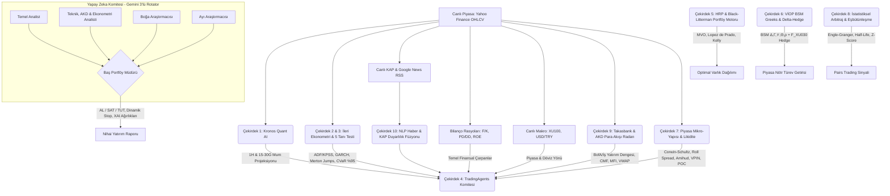

# 📈 BIST 100 Hybrid AI Quant, Econometrics & Institutional Multi-Asset Trading System


Bu proje, Borsa İstanbul (BIST) hisse senetleri ve VİOP türev piyasaları için geliştirilmiş; **Derin Öğrenme (Deep Learning) tabanlı kantitatif fiyat tahmini**, **İleri Ekonometri & 5 Temel Tanısal Test Bataryası**, **GARCH(1,1) & Merton Poisson Jump Diffusion Stokastik Simülasyonu**, **Hiyerarşik Risk Paritesi (HRP) & Black-Litterman Portföy Tahsisi**, **Black-Scholes-Merton (BSM) Opsiyon Greeks & Dinamik Delta-Hedge**, **Piyasa Mikro-Yapısı & VPIN Akış Toksisitesi**, **İstatistiksel Arbitraj & Eşbütünleşme (Pairs Trading)**, **Takasbank & AKD Balina Radarı** ve **Çoklu-Ajan (Multi-Agent) Komite Tartışması (TradingAgents)** kurgusunu birleştiren kurumsal düzeyde hibrit bir yatırım fonu, kantitatif analiz ve risk yönetim platformudur.

---

## 🚀 Proje Vizyonu
Piyasalardaki klasik indikatör botlarının veya kara kutu (black box) yapay zekaların aksine, bu sistem kararlarını tek bir modele bağlamaz. Karar alma süreci; ekonometrik tanı testleri (Jarque-Bera, Durbin-Watson, Breusch-Godfrey, White, Ramsey RESET), mikro-volatilite tahmincileri (Yang-Zhang, Parkinson), 1.000 yollu Merton sıçramalı Monte Carlo simülasyonu, Lopez de Prado Hiyerarşik Risk Paritesi, BSM opsiyon duyarlılıkları, canlı KAP duyarlılığı, Takasbank & AKD kurumsal balina takibi ve gerçek bir Wall Street araştırma masasındaki gibi farklı disiplinlerden gelen yapay zeka ajanlarının masada kıyasıya tartışmasıyla (**Boğa vs Ayı Debate**) ve Baş Portföy Yöneticisinin nihai **Açıklanabilir Yapay Zeka (XAI)** kararını vermesiyle sonuçlanır.

---

## 🧠 Sistem Mimarisi

Sistem birbirine entegre çalışan **10 ana Çekirdek (Core)** üzerinden çalışır:


```mermaid
graph TD
    A[Canlı Piyasa: Yahoo Finance OHLCV] --> B(Çekirdek 1: Kronos Quant AI)
    A --> E_CON(Çekirdek 2 & 3: İleri Ekonometri & 5 Tanı Testi)
    A --> C[Canlı KAP & Google News RSS]
    A --> F[Bilanço Rasyoları: F/K, PD/DD, ROE]
    A --> G[Canlı Makro: XU100, USD/TRY]
    A --> AKD(Çekirdek 9: Takasbank & AKD Para Akışı Radarı)
    A --> MS(Çekirdek 7: Piyasa Mikro-Yapısı & Likidite)
    
    C --> NLP(Çekirdek 10: NLP Haber & KAP Duyarlılık Füzyonu)
    NLP --> D(Çekirdek 4: TradingAgents Komitesi)
    AKD -->|BofA/İş Yatırım Dengesi, CMF, MFI, VWAP| D
    MS -->|Corwin-Schultz, Roll Spread, Amihud, VPIN, POC| D
    B -->|1H & 15-30G Mum Projeksiyonu| D
    E_CON -->|ADF/KPSS, GARCH, Merton Jumps, CVaR %95| D
    F -->|Temel Finansal Çarpanlar| D
    G -->|Piyasa & Döviz Yönü| D
    
    subgraph Committee [Yapay Zeka Komitesi - Gemini 3'lü Rotator]
    D1[Temel Analist]
    D2[Teknik, AKD & Ekonometri Analisti]
    D3[Boğa Araştırmacısı]
    D4[Ayı Araştırmacısı]
    D1 --> D5{Baş Portföy Müdürü}
    D2 --> D5
    D3 --> D5
    D4 --> D5
    end
    
    D5 -->|AL / SAT / TUT, Dinamik Stop, XAI Ağırlıkları| E[Nihai Yatırım Raporu]
    
    PORT(Çekirdek 5: HRP & Black-Litterman Portföy Motoru) -->|MVO, Lopez de Prado, Kelly| ALLOC[Optimal Varlık Dağılımı]
    VIOP_ENG(Çekirdek 6: VİOP BSM Greeks & Delta-Hedge) -->|BSM Δ,Γ,𝒱,Θ,ρ + F_XU030 Hedge| HEDGE[Piyasa Nötr Türev Getirisi]
    PAIRS(Çekirdek 8: İstatistiksel Arbitraj & Eşbütünleşme) -->|Engle-Granger, Half-Life, Z-Score| STAT_ARB[Pairs Trading Sinyali]
```

---

## 🏛️ 10 Temel Çekirdek (Core Engines)

### 🔹 Çekirdek 1: Kronos-Base Quant Model (PyTorch & Candlestick Sanitizer)
* **102.3 Milyon parametreli** Transformer tabanlı finansal zaman serisi tahmin modelidir.
* **Candlestick Physical Consistency & Circuit Breaker Filter:** Fiziksel $High \ge \max(Open, Close)$ ve $Low \le \min(Open, Close)$ tutarlılığı garantilenir ve BIST ±%10 günlük tavan/taban devre kesici limitleri denetlenir.
* Geçmiş 256 günlük mum grafiğini alarak **1 Haftalık (Kısa Vade)** ve **15-30 Günlük (Orta Vade)** çoklu Monte Carlo çıkarım yolları (`Multi-path inference`) üzerinden destek, direnç ve beklenen getiri projeksiyonunu hesaplar.

### 🔹 Çekirdek 2: İleri Ekonometri, GARCH(1,1) & Merton Jump Diffusion
* **Çift Doğrulamalı Durağanlık (ADF & KPSS):** Serinin birim kök ve trend karakterini ($I(1) \to I(0)$) matematiksel olarak ispatlar.
* **GARCH(1,1) Koşullu Varyans Modellemesi:** Zamana bağlı volatilite kümelenmesini (volatility clustering) MLE ile çözer ve simülasyon adımlarına değişken varyans olarak aktarır.
* **Merton Jump Diffusion (Poisson Sıçramalı Şişman Kuyruk):** Standart normal dağılım yerine BIST'in ani haber şoklarını $dN_t \sim \text{Poisson}(\lambda)$ sıçrama prosesi ile modelleyerek şişman kuyruk (fat-tail) riskini tam yansıtır.
* **Extreme Value Theory (EVT) & Expected Shortfall (CVaR %95 / %99):** Olası kriz senaryolarındaki ortalama kuyruk kaybını ve maksimum riske maruz değeri hesaplar.

### 🔹 Çekirdek 3: 5 Temel Ekonometrik Tanısal Test Bataryası
1. **Normallik:** Jarque-Bera ($JB$) ve D'Agostino-Pearson ($K^2$) çarpıklık/basıklık sınaması.
2. **Otokorelasyon:** Durbin-Watson ($d$) ve Breusch-Godfrey LM ($\chi^2$) yüksek dereceli ardışık bağımlılık testi.
3. **Değişen Varyans:** Breusch-Pagan, White Testi ve ARCH-LM dinamik oynaklık testi.
4. **Model Spesifikasyonu:** Ramsey RESET ($F$-istatistiği) ile doğrusal olmayan form hatası tespiti.
5. **Çoklu Doğrusal Bağlantı:** VIF (Variance Inflation Factor) ve Şartlı Sayı ($CI = \sqrt{\lambda_{\max}/\lambda_{\min}}$) kontrolü.

### 🔹 Çekirdek 4: TradingAgents Çoklu Yapay Zeka Komitesi & Deterministik Veto Kalkanı
* **3'lü Gemini API Rotasyon Motoru:** Kota sınırına takılmadan anahtarlar arasında dinamik ve kesintisiz geçiş yapar (`gemini-3.5-flash`).
* **Deterministik Hard-Gate Veto Kalkanı:** LLM'in doğal yükseliş yanlılığına (Bullish Bias) karşı koruma sağlar. Monte Carlo kazanma olasılığı <%38 ve CMF para çıkışı varsa, komitenin "AL" kararı otomatik olarak "TUT / GÖZLEMLE" statüsüne veto edilir.
* **Boğa vs. Ayı Çatışması (Debate Protocol):** Boğa analisti yükseliş katalizörlerini savunurken, Ayı analisti değer tuzaklarını ve riskleri acımasızca sorgular.

### 🔹 Çekirdek 5: Hiyerarşik Risk Paritesi (HRP) & Black-Litterman Portföy Motoru
* **Ledoit-Wolf Shrinkage:** Örneklem kovaryans matrisindeki tahmin gürültülerini analitik olarak daraltır.
* **Markowitz Ortalama-Varyans (MVO):** Maksimum Sharpe (Tangency) ve Global Minimum Varyans (GMV) portföyü.
* **Hiyerarşik Risk Paritesi (HRP - Marcos Lopez de Prado):** Matris tersi almadan korelasyon ağacı kümelemesi ile istikrarlı risk dağıtımı.
* **Black-Litterman Modeli:** Piyasa denge getirilerini ($\Pi$) yapay zeka görüşleri ($P, Q, \Omega$) ile Bayes Teoremi üzerinden birleştirir.
* **Multi-Asset Kelly Kriteri:** Geometrik sermaye büyümesini maksimize eden fraksiyonel kaldıraç oranını hesaplar.

### 🔹 Çekirdek 6: BSM Opsiyon Fiyatlama, Greeks & Dinamik Delta-Hedge
* **Black-Scholes-Merton (1973) Analitik Opsiyon Fiyatlaması:** Temettü ve faiz entegre Avrupa tipi Call/Put fiyatları.
* **1. ve 2. Derece Greeks:** Delta ($\Delta$), Gamma ($\Gamma$), Vega ($\mathcal{V}$), Theta ($\Theta$), Rho ($\rho$), Vanna ve Volga.
* **Zımni Oynaklık (IV) Kök Bulucu:** Brent metoduyla piyasa opsiyon fiyatından volatiliteyi tersine çözer.
* **Dinamik Portföy Delta-Hedging:** Spot hisse portföyünü BIST 30 Vadeli Kontratı (`F_XU030`) ile tam piyasa nötr ($\Delta$-neutral, $\beta$-hedged) hale getirir.

### 🔹 Çekirdek 7: Piyasa Mikro-Yapısı & VPIN Akış Toksisitesi
* **Corwin-Schultz (2012) Spread Tahmincisi:** Günlük High-Low marjından efektif alış-satış makasını baz puan (bps) olarak çözer.
* **Roll (1984) Efektif Makası & Amihud (2002) İlikidite:** 1 Milyon TL'lik emrin tahtayı kaç baz puan kaydırdığını (Kyle's Lambda) ölçer.
* **VPIN (Volume-Synchronized Probability of Toxicity):** Kurumsal balinaların ve algoritmik botların agresif akış toksisitesini ölçer.
* **Hacim Profili (Volume Profile):** En yoğun kurumsal hacmin gerçekleştiği Point of Control (POC), Value Area High (VAH) ve Value Area Low (VAL) seviyelerini belirler.

### 🔹 Çekirdek 8: İstatistiksel Arbitraj & Eşbütünleşme (Pairs Trading)
* **Engle-Granger 2-Aşamalı Eşbütünleşme Testi:** İki hisse arasındaki uzun dönemli denge ilişkisini sınar.
* **Ornstein-Uhlenbeck Yarılanma Ömrü (Half-Life):** Spread'in ortalamaya dönme hızını gün cinsinden hesaplar.
* **Spread Z-Score:** $\pm 2\sigma$ standart sapma sapmalarında Long Spread / Short Spread arbitraj sinyalleri üretir.

### 🔹 Çekirdek 9: Takasbank & AKD Para Akışı Radarı
* **Doğrudan Terminal CSV Köprüsü:** Matriks / İdealData kurum dağılım dosyalarını (`bist_data/akd/<SEMBOL>_akd.csv`) doğrudan okur.
* **Chaikin Para Akışı (CMF - 20G) & MFI (14G):** Para girişi ve çıkışını matematiksel olarak tespit eder.
* **İlk 5 Kurum Konsantrasyon Dengesi & Balina Skoru:** Bank of America (BofA), QNB, İş Yatırım gibi piyasa yapıcı aktörlerin akümülasyon hareketlerini puanlar.

### 🔹 Çekirdek 10: Çok Modlu NLP Haber & KAP Duyarlılık Füzyonu
* **Doğrudan KAP REST Entegrasyonu (`kap.gov.tr`):** Resmi şirket bildirimlerini ve Google News TR akışını doğrudan tarar.
* **Finansal NLP Duyarlılık Skorlaması:** Bildirimleri analiz edip `[-1.0, +1.0]` arasında duyarlılık skoru ve `[%0, %100]` etki şiddeti üretir.
* **Matematiksel Füzyon:** Haber skorunu teknik beklentiye dinamik olarak entegre eder ($R_{\text{fused}} = (1-w)R_{\text{tech}} + w(S_{\text{news}} I \sigma)$).

---

## 💻 Kullanım Komutları (CLI Rehberi)

### 1. Tekil Hisse Derin Komite Analizi (Quant + VİOP + AKD + Ekonometri)
```bash
python main.py --analyze ISCTR.IS --days 15
```

### 2. Tam Ekonometrik Tanı & Merton Monte Carlo Raporu
```bash
python main.py --econometrics ISCTR.IS --days 15
```

### 3. Çoklu Model Portföy Optimizasyonu (Markowitz, HRP, Black-Litterman, Kelly)
```bash
python main.py --portfolio-opt "THYAO.IS,ISCTR.IS,AKBNK.IS,ASELS.IS,BIMAS.IS"
```

### 4. Piyasa Mikro-Yapısı, Makas (Spread), Likidite & VPIN Toksisite Analizi
```bash
python main.py --microstructure ISCTR.IS
```

### 5. İstatistiksel Arbitraj & Eşbütünleşme (Pairs Trading)
```bash
python main.py --pairs-trade "ISCTR.IS,AKBNK.IS"
```

### 6. Black-Scholes-Merton Opsiyon Fiyatlama, Greeks & Delta-Hedge
```bash
python main.py --greeks ISCTR.IS --days 30
```

### 7. Takasbank & AKD Para Giriş/Çıkış Radarı
```bash
# Tekil hisse AKD analizi
python main.py --akd ISCTR.IS

# BIST 30 genelini kurumsal para akışına göre tara
python main.py --akd-scan bist30 --top 15
```

### 8. VİOP Çift Yönlü Sinyal Taraması & Walk-Forward Backtest
```bash
# Canlı VİOP Long/Short fırsatları
python main.py --viop-signals --top 10

# 12 Aylık VİOP Walk-Forward Backtest (Kaldıraç: 1.5x)
python main.py --backtest FROTO.IS --months 12 --use-kronos-backtest --viop
```

---

## ⚠️ Yasal Uyarı (Disclaimer)
Bu proje tamamen eğitim, akademik araştırma ve kantitatif modelleme amacıyla geliştirilmiştir. Üretilen çıktılar, fiyat projeksiyonları ve komite kararları **kesinlikle doğrudan yatırım tavsiyesi (YTD) niteliği taşımaz**.
