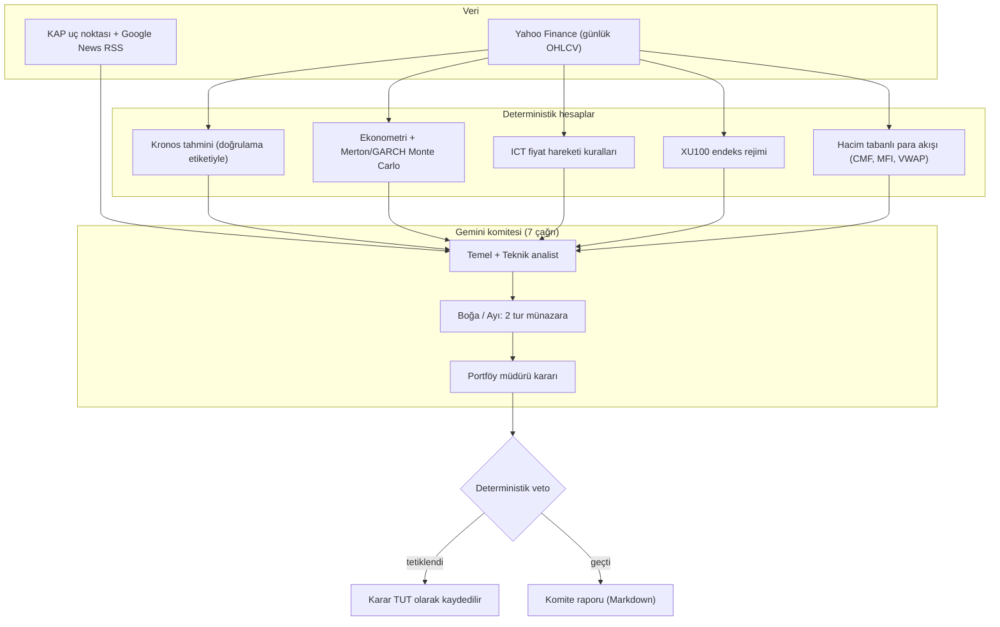

# KRONOS: BIST 100 & VİOP Hibrit Yapay Zeka ve Kantitatif Araştırma Sistemi

<div align="center">


</div>

**KRONOS**, Borsa İstanbul (BIST 100 / BIST 30) hisseleri için bir araştırma ve deney ortamıdır. Kronos zaman serisi
modeliyle fiyat tahmini, klasik ekonometri ve Monte Carlo simülasyonu, kural tabanlı fiyat hareketi (ICT) tespiti ve
Gemini tabanlı çok ajanlı bir münazara komitesini tek bir komut satırı aracında birleştirir.

> **Bu sistem kârlılığı kanıtlanmış bir strateji değildir.** Aşağıdaki "Ölçülen Sonuçlar" bölümü, sistemin kendi
> araçlarıyla yapılan ölçümleri olduğu gibi verir: şu ana kadar test edilen hiçbir bileşen "al ve tut" ya da
> "fiyat değişmeyecek" kıyaslamasını geçememiştir.

---

## Ölçülen Sonuçlar

Ölçümler 7 Ekim 2026 tarihinde, depodaki araçlarla alınmıştır. Tek dönem ve tek piyasa rejimini yansıtır.

### Kural tabanlı strateji (Kronos'suz), BIST30, son 12 ay, maliyetler dahil

`python main.py --backtest-universe bist30 --months 12`

| Ölçü | Değer |
| :--- | ---: |
| Test edilen hisse | 33 |
| Medyan strateji getirisi | −%6,01 |
| Medyan al-tut getirisi | +%7,19 |
| Medyan fark | −%15,56 |
| Al-tut'u geçen hisse oranı | %33,3 |
| Toplam işlem | 376 |

### Kronos tahmin isabeti, BIST30, 396 tahmin noktası (3 Kasım 2025 – 15 Eylül 2026), 15 günlük ufuk

`python main.py --compare-models bist30`

| Model | Yön isabeti | Ort. mutlak hata | Naife göre beceri |
| :--- | ---: | ---: | ---: |
| Naif ("fiyat değişmeyecek") | — | %8,23 | 0 |
| Yeni ince ayar (hisse bazlı pencereler) | %48,2 | %11,09 | −%34,8 |
| Temel Kronos (ince ayarsız) | %50,8 | %14,94 | −%81,6 |
| Eski ince ayar (hatalı veri hattı) | %48,7 | %17,41 | −%111,7 |

Yeni ince ayar diğer iki modelden daha isabetlidir, ancak üç model de naif tahminin gerisindedir ve yön isabeti
yazı-tura düzeyindedir. Bu nedenle Kronos çıktısı sistemde **DOĞRULANMADI** olarak etiketlenir; komite kararına
gerekçe yapılmaz ve tarama sıralamasında kullanılmaz. Test dönemi model seçiminde kullanılan doğrulama dönemiyle
örtüştüğü için sonuç ince ayarlı model lehine hafif iyimserdir.

---

## Sistem Akışı


```mermaid
flowchart TD
    subgraph Veri ["Veri"]
        YF["Yahoo Finance (günlük OHLCV)"]
        NEWS["KAP uç noktası + Google News RSS"]
    end

    subgraph Hesap ["Deterministik hesaplar"]
        KRONOS["Kronos tahmini (doğrulama etiketiyle)"]
        ECON["Ekonometri + Merton/GARCH Monte Carlo"]
        ICT["ICT fiyat hareketi kuralları"]
        GATE["XU100 endeks rejimi"]
        FLOW["Hacim tabanlı para akışı (CMF, MFI, VWAP)"]
    end

    subgraph Komite ["Gemini komitesi (7 çağrı)"]
        ANALIST["Temel + Teknik analist"]
        DEBATE["Boğa / Ayı: 2 tur münazara"]
        PM["Portföy müdürü kararı"]
    end

    YF --> KRONOS & ECON & ICT & GATE & FLOW
    NEWS --> ANALIST
    KRONOS & ECON & ICT & GATE & FLOW --> ANALIST --> DEBATE --> PM
    PM --> VETO{"Deterministik veto"}
    VETO -->|tetiklendi| TUT["Karar TUT olarak kaydedilir"]
    VETO -->|geçti| RAPOR["Komite raporu (Markdown)"]
```

Sistem emir göndermez; çıktısı rapor ve sinyaldir.

---

## Bileşenler ve Gerçek Durumları

| Bileşen | Ne yapar | Durum |
| :--- | :--- | :--- |
| **Kronos tahmini** | Kronos-base (102,3M parametre) ile 5 ve 15 günlük mum tahmini; BIST verisiyle ince ayar yapılabilir | Çalışıyor; tahmin isabeti doğrulanmadı (yukarıdaki tablo) |
| **Ekonometri** | ADF/KPSS, Jarque-Bera, Durbin-Watson, Breusch-Godfrey, ARCH-LM, XU100'e karşı CAPM alfa/beta, GARCH(1,1) ve Merton sıçramalı Monte Carlo | Çalışıyor; sıçrama parametreleri sabit varsayımdır |
| **ICT fiyat hareketi** | Likidite süpürmesi (BSL/SSL), Fair Value Gap, kırılım-retest tespiti | Kural tabanlı; getiriye katkısı ölçülmedi |
| **Endeks kapısı** | XU100'ün SMA50, EMA21, RSI ve ADX değerlerinden piyasa rejimi çıkarır | Çalışıyor |
| **Para akışı göstergeleri** | Yalnızca fiyat-hacim verisinden CMF, MFI, VWAP ve bileşik skor | Çalışıyor; **kurum bazlı veri içermez** |
| **Aracı kurum dağılımı (AKD)** | `bist_data/akd/<HİSSE>_akd.csv` dosyası sağlanırsa ilk 5 alıcı/satıcı payını okur | Veri kaynağı dahil değil; dosya yoksa "VERİ YOK" |
| **KAP bildirimleri** | `kap.org.tr` uç noktasını sorgular; duyarlılık motoru Google News RSS'e düşer | KAP uç noktası 7 Ekim 2026 denemesinde yanıt vermedi; bu durumda "VERİ YOK" bildirilir |
| **Komite** | Temel analist, teknik analist, boğa/ayı (2 tur) ve portföy müdürü promptlarıyla Gemini çağrıları | Çalışıyor; kararların isabeti ölçülmedi |
| **Deterministik veto** | Endeks rejimi alıma kapalıysa, ya da Monte Carlo kazanma olasılığı %38'in altında **ve** CMF −0,12'nin altındaysa alım kararını TUT'a çevirir | Çalışıyor |
| **Karar hafızası** | Geçmiş komite kararlarını ve sonradan gerçekleşen getiriyi saklar, sonraki analize özet olarak verir | Çalışıyor |
| **İşlem hafızası** | Kullanıcının kaydettiği işlemleri ve çıkarılan dersleri saklar | Boş başlar; kayıt yoksa "kayıt yok" |
| **VİOP hesapları** | Taşıma maliyetiyle teorik vadeli fiyat, Black-Scholes-Merton primi ve Greeks, pozisyon büyüklüğü | Çalışıyor; teminat oranları kodda sabit yaklaşık değerlerdir, Takasbank'ın güncel oranlarıyla doğrulanmadı |
| **Portföy optimizasyonu** | Markowitz, HRP, Black-Litterman, Kelly | Çalışıyor; beklenen getiri girdileri varsayımdır |
| **Backtest** | Walk-forward; komisyon, kayma, boşluklu açılışta stop dolumu, günlük sermaye eğrisinden metrikler, veri sızıntısı denetimi | Çalışıyor; temettüler hesaba katılmaz |
| **DuckDB** | CSV mumlarını yerel veritabanına aktarır, taramada hızlı ön eleme yapar | İsteğe bağlı |
| **Telegram botu** | `--bot` komutu `private_interactive_telegram.py` dosyasını gerektirir | **Bu depoda yok** (özel dosya) |

`repos/` altında Kronos ve TradingAgents projelerinin kopyaları bulunur. Kronos'un model ve eğitim kodu kullanılır.
Komite TradingAgents'tan esinlenmiştir ancak onun kodunu çağırmaz; kendi promptlarıyla çalışır.

### Veri bütünlüğü kuralı

Veri alınamayan alanlar (aracı kurum dağılımı, KAP bildirimi, endeks betası, işlem hafızası, politika faizi) komiteye
tahmini değerlerle değil açıkça **VERİ YOK** olarak iletilir. Promptlar, bu alanlar için sayı, kurum adı veya olay
uydurulmamasını ve doğrulanmamış Kronos tahmininin gerekçe yapılmamasını şart koşar.

---

## Kurulum

```bash
pip install -r requirements.txt
```

Test edilen ortam: Python 3.12, Windows 10, NVIDIA GTX 1650 (4 GB), torch 2.6.0 (CUDA 12.4), pandas 2.3.3,
numpy 2.5.3, yfinance 1.5.2. `requirements.txt` sürüm sabitlemez.

Proje kökünde bir `.env` dosyası gerekir:

```bash
GOOGLE_API_KEY_1=...             # Gemini anahtarı (komite ve duyarlılık analizi için). _2, _3 ... eklenebilir
KRONOS_RISK_FREE_RATE_PCT=45     # Yıllık risksiz faiz varsayımı: VİOP nemalandırma, BSM, Sharpe, CAPM (tanımsızsa %45)
KRONOS_POLICY_RATE_PCT=          # TCMB politika faizi; tanımsızsa komiteye "VERİ YOK" olarak bildirilir
```

Kronos ağırlıkları ilk kullanımda Hugging Face'ten indirilir. İnce ayarlı model ağırlıkları depoda yoktur;
`models/bist_kronos/` altında yalnızca model kayıtları (yapılandırma, epoch sayacı, eğitim kesim tarihi, doğrulama
özeti) tutulur. Yerelde ince ayarlı model yoksa temel Kronos kullanılır.

```bash
python -m pytest tests          # 133 test
```

---

## Kullanım

### Veri

```bash
python main.py --download-all            # BIST100 listesinin tüm geçmişini indirir, eğitim veri kümesini üretir
python main.py --sync-db                 # CSV mumlarını DuckDB'ye aktarır (isteğe bağlı)
```

İndirmeler `bist_data/raw/` altındaki dosyalarla birleştirilir; kısa periyotlu bir indirme uzun geçmişi silmez.

### Analiz

```bash
python main.py --analyze BIMAS.IS --days 15       # Tam komite raporu (Gemini anahtarı gerekir)
python main.py --scan bist30 --top 5              # Ön eleme + ilk N hisse için komite
python main.py --econometrics THYAO.IS            # Ekonometrik tanı ve Monte Carlo
python main.py --microstructure ISCTR.IS          # Makas, Amihud, VPIN, hacim profili
python main.py --akd ISCTR.IS                     # Para akışı göstergeleri (varsa aracı kurum dağılımı)
python main.py --sentiment ASELS.IS               # Haber duyarlılığı
python main.py --pairs-trade ISCTR.IS,AKBNK.IS    # Eşbütünleşme
python main.py --greeks THYAO.IS                  # BSM primi ve Greeks
python main.py --portfolio-opt "THYAO.IS,ISCTR.IS,AKBNK.IS,ASELS.IS,BIMAS.IS"
python main.py --memory ISCTR.IS                  # Geçmiş komite kararları ve gerçekleşen getiri
```

### Backtest

```bash
python main.py --backtest FROTO.IS --months 12                      # Tek hisse, kural tabanlı tahminci
python main.py --backtest FROTO.IS --months 12 --use-kronos-backtest # Aynı kurallar, Kronos tahminiyle
python main.py --backtest FROTO.IS --viop --leverage 1.5            # Çift yönlü, kaldıraçlı
python main.py --backtest-universe bist30 --months 12               # Tüm evren: medyan fark, al-tut'u geçen oran
```

Seçenekler: `--commission-bps` ve `--slippage-bps` (varsayılan spot 10 + 5, VİOP 4 + 5 baz puan), `--sl`,
`--fixed-tp` ile birlikte `--tp`. Tek hisse ve tek dönem sonucu kanıt değildir; kuralları değerlendirmek için evren
koşusunu kullanın.

### Kronos ince ayarı ve doğrulama

```bash
python main.py --train-predictor --pred-epochs 3 --fresh-train --train-steps 5000 --val-steps 500
python main.py --compare-models bist30
```

- Eğitim pencereleri hisse bazında kurulur: her pencere tek bir hissenin ardışık günlerinden oluşur. Eğitim ve
  doğrulama tüm hisseler için ortak bir tarihten ayrılır.
- `--fresh-train` mevcut modeli silmeden arşivler ve önceden eğitilmiş Kronos ağırlıklarından başlar. Bayrak
  verilmezse eğitim kayıtlı modelin üzerine devam eder; `--pred-epochs` toplam epoch sayısıdır.
- `--train-steps` olmadan bir epoch yaklaşık 219.000 adımdır (GTX 1650'de yaklaşık 61 saat). Yukarıdaki komut
  aynı donanımda 4,7 saat sürmüştür.
- Eğitim bitince eğitim kesim tarihi kaydedilir; backtest, test döneminin bu tarihten sonra başlayıp başlamadığını
  denetler ve sonucu raporda belirtir.
- `--compare-models` modelleri aynı hisse ve tarihlerde ölçer ve doğrulama özetini günceller. Bir model naif
  tahmini geçer ve yön isabeti %50'yi aşarsa etiketi kendiliğinden "DOĞRULANDI" olur. Model yeniden eğitilirse
  eski ölçüm geçersiz sayılır.

---

## Bilinen Sınırlar

- **Kanıtlanmış bir avantaj yok.** Ne kural tabanlı strateji ne de Kronos tahmini kıyaslamayı geçti.
- **Komite kararları ölçülmedi.** Gemini komitesinin kararlarının isabetine dair sistematik bir test yoktur.
- **Bileşen katkısı ölçülmedi.** ICT kuralları, para akışı skoru ve endeks kapısının sonuca tek tek etkisi bilinmiyor.
- **Veri kaynağı tek ve ücretsiz.** Fiyatlar Yahoo Finance'ten gelir; temettü düzeltmesi yapılmaz, bazı eski
  bölünmeler düzeltilmemiş kalabilir (521.330 mumda tek günde %50'yi aşan 40 sıçrama).
- **Hisse listesi güncel değil.** BIST100 listesindeki 112 sembolden 4'ü (IPEKE, KNYAS, KOZAL, KOZAA) indirilemiyor.
- **Sabit varsayımlar.** VİOP teminat oranları, Monte Carlo sıçrama parametreleri ve Black-Litterman beklenen getirisi
  kodda sabittir.
- **Bağımlılık sürümleri sabitlenmemiştir.**

---

## Proje Dizin Yapısı

```text
KRONOS/
├── main.py                            # Komut satırı arayüzü
├── bist_quant/
│   ├── bist_downloader.py             # Yahoo Finance indirme, geçmişle birleştirme
│   ├── bist_preprocess.py             # Hisse etiketli eğitim veri kümesi
│   ├── bist_kline_dataset.py          # Hisse bazlı pencereleyen eğitim veri kümesi
│   ├── bist_finetune_runner.py        # Kronos eğitimini bu veri kümesiyle başlatır
│   ├── bist_trainer.py                # Eğitim yöneticisi (arşivleme, adım sınırı, kesim tarihi)
│   ├── bist_kronos_quant.py           # Kronos tahmini ve raporu
│   ├── bist_model_eval.py             # Modellerin yan yana isabet ölçümü
│   ├── kronos_validation.py           # Doğrulama durumu ve etiketi
│   ├── backtest_engine.py             # Çıkış simülasyonu, maliyet modeli, metrikler
│   ├── bist_backtester.py             # Walk-forward ve evren backtesti
│   ├── bist_econometrics.py           # Tanı testleri, CAPM, GARCH, Merton Monte Carlo
│   ├── bist_price_action.py           # ICT kuralları
│   ├── bist_index_gatekeeper.py       # XU100 rejimi
│   ├── bist_akd_flow.py               # Para akışı göstergeleri, isteğe bağlı aracı kurum dağılımı
│   ├── bist_kap_scraper.py            # KAP bildirim sorgusu
│   ├── bist_sentiment.py              # Haber duyarlılığı
│   ├── bist_microstructure.py         # Makas, Amihud, VPIN, hacim profili
│   ├── bist_viop.py                   # Vadeli fiyat, BSM, Greeks
│   ├── bist_portfolio_opt.py          # Markowitz, HRP, Black-Litterman, Kelly
│   ├── bist_memory.py                 # Komite karar hafızası
│   ├── bist_trade_memory.py           # İşlem hafızası
│   ├── bist_scanner.py                # Evren taraması
│   ├── bist_duckdb_engine.py          # DuckDB aktarımı ve ön eleme
│   └── market_assumptions.py          # Faiz varsayımları (.env)
├── hybrid_agents/
│   ├── bist_committee.py              # Komite orkestrasyonu ve veto
│   ├── verdict_parser.py              # Karar satırının ayrıştırılması
│   ├── prompts.py                     # Ajan promptları
│   ├── context_firewall.py            # Mum geçmişinin özetlenmesi
│   └── gemini_rotator.py              # Gemini istemcisi ve anahtar rotasyonu
├── tests/                             # pytest testleri
├── models/bist_kronos/                # Model kayıtları (ağırlıklar depoda yok)
└── repos/                             # Kronos ve TradingAgents kaynak kopyaları
```

---

## Yasal Uyarı

Bu yazılım ve ürettiği tüm çıktılar (tahminler, sinyaller, komite raporları) **araştırma ve yazılım geliştirme
amacıyla** üretilmiştir. Hiçbir çıktı **yatırım tavsiyesi değildir**. Yukarıdaki ölçümler sistemin kıyaslamaları
geçemediğini göstermektedir. Finansal piyasalarda ve kaldıraçlı türev ürünlerde işlem yapmak anapara kaybı riski taşır.
